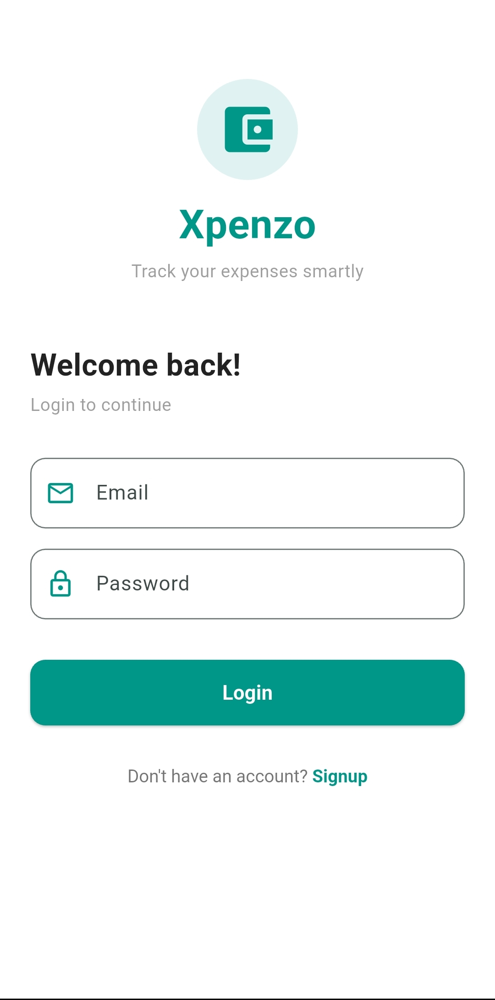
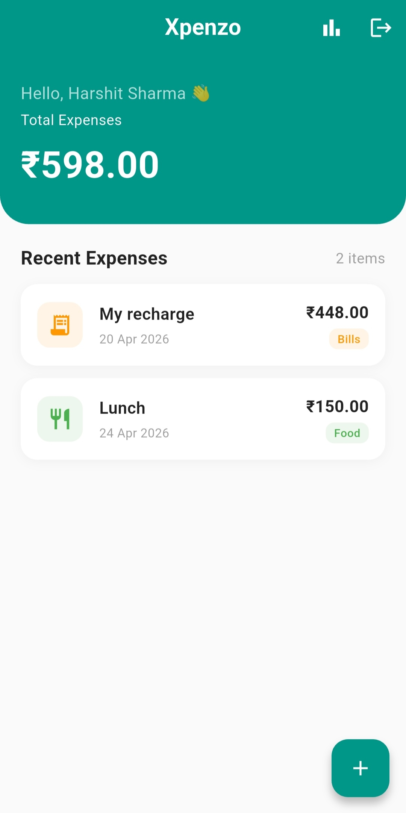
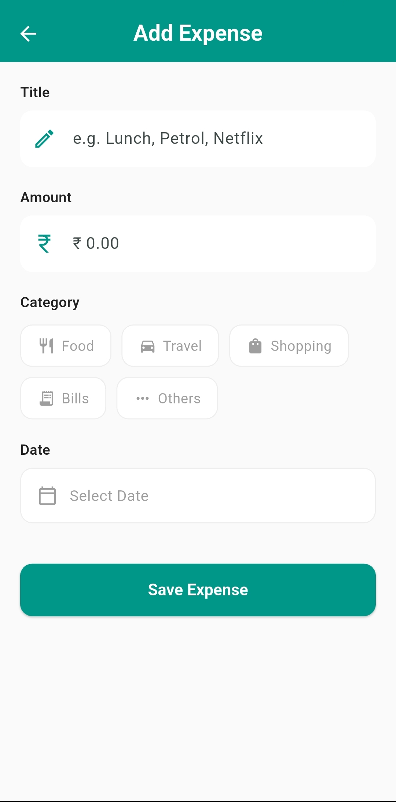
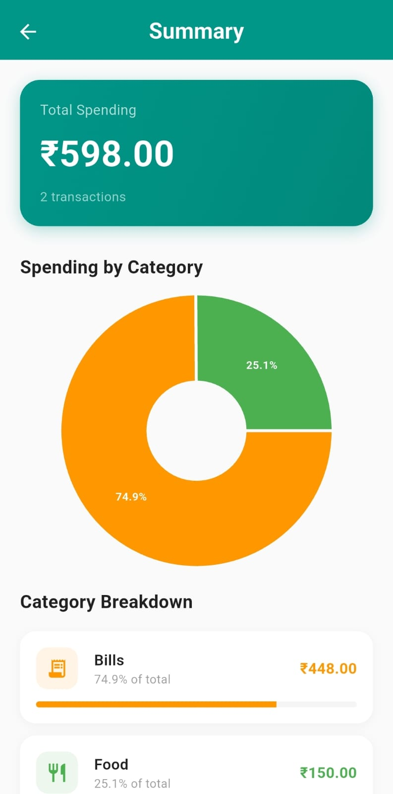

# 💸 Xpenzo — Smart Expense Tracker

A full-stack mobile expense tracking application built with **Flutter & Firebase**, featuring real-time data sync, beautiful UI, and insightful spending analytics.

---

## 📱 Screenshots


<p float="left">
  
  
  
  
</p>

---

## ✨ Features

- 🔐 **User Authentication** — Secure signup & login with Firebase Auth
- ➕ **Add Expenses** — Add expenses with title, amount, category & date
- 🗂️ **Categories** — Food, Travel, Shopping, Bills, Others
- 🗑️ **Swipe to Delete** — Easily remove expenses with a swipe gesture
- 📊 **Summary & Analytics** — Pie chart with category-wise breakdown
- 📈 **Progress Bars** — Visual spending percentage per category
- 🔄 **Real-time Sync** — Data syncs instantly across sessions via Firestore
- 👤 **User-specific Data** — Each user sees only their own expenses

---

## 🛠️ Tech Stack

| Technology | Usage |
|------------|-------|
| **Flutter & Dart** | Cross-platform mobile development |
| **Firebase Auth** | User authentication |
| **Cloud Firestore** | Real-time NoSQL database |
| **Riverpod** | State management |
| **fl_chart** | Pie chart & analytics |
| **intl** | Date formatting |
| **uuid** | Unique ID generation |

---

## 🏗️ Project Structure

```
lib/
├── main.dart
├── firebase_options.dart
├── models/
│   └── expense_model.dart
├── providers/
│   ├── auth_provider.dart
│   └── expense_provider.dart
├── services/
│   └── firestore_service.dart
├── screens/
│   ├── auth/
│   │   ├── login_screen.dart
│   │   └── signup_screen.dart
│   ├── home/
│   │   └── home_screen.dart
│   ├── add_expense/
│   │   └── add_expense_screen.dart
│   └── summary/
│       └── summary_screen.dart
└── widgets/
```

---

## 🚀 Getting Started

### Prerequisites
- Flutter SDK (3.0+)
- Dart SDK
- Firebase account
- Android Studio / VS Code

### Installation

**1. Clone the repository**
```bash
git clone https://github.com/harshits-07/xpenzo.git
cd xpenzo
```

**2. Install dependencies**
```bash
flutter pub get
```

**3. Firebase Setup**
- Create a Firebase project at [console.firebase.google.com](https://console.firebase.google.com)
- Enable **Email/Password Authentication**
- Create a **Firestore Database** in test mode
- Run FlutterFire CLI to connect:
```bash
dart pub global activate flutterfire_cli
flutterfire configure
```

**4. Run the app**
```bash
flutter run
```

---

## 📦 Dependencies

```yaml
flutter_riverpod: ^2.5.1
firebase_core: ^3.1.0
firebase_auth: ^5.1.0
cloud_firestore: ^5.1.0
fl_chart: ^0.68.0
intl: ^0.19.0
uuid: ^4.4.0
```

---

## 🔥 Key Concepts Used

- **Riverpod StateNotifier** — managing expense list state
- **StreamProvider** — real-time auth state detection
- **Firestore Streams** — live data updates without manual refresh
- **Clean Architecture** — separation of models, services, providers & UI
- **ConsumerWidget & ConsumerStatefulWidget** — Riverpod UI integration
- **Firebase Auth Flow** — signup → login → home → logout cycle

---

## 👨‍💻 Developer

**Harshit Sharma**
- 📧 sharmahs2511@gmail.com
- 💼 [LinkedIn](https://linkedin.com/in/harshits07)
- 🐙 [GitHub](https://github.com/harshits-07)
- 📱 Flutter Developer | Open to Opportunities

---

## 📄 License

This project is open source and available under the [MIT License](LICENSE).

---

⭐ If you found this project helpful, please give it a star!
